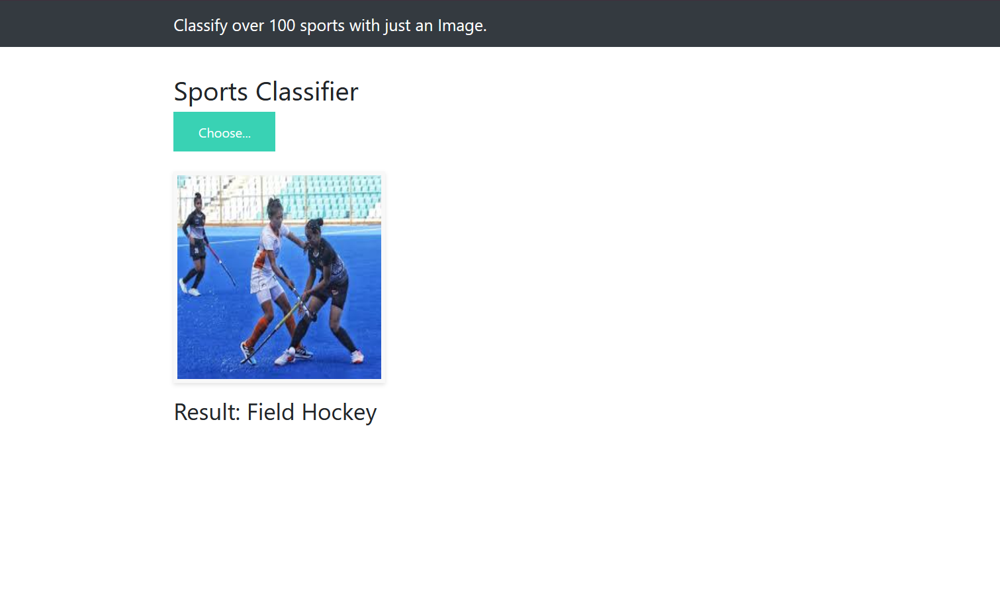

# Sports Classification

[](https://www.gnu.org/licenses/gpl-3.0.html)

A sports classification project that utilizes transfer learning with the ResNet15V2 model and Flask to classify sports images. The goal of this project is to build a robust image classification system capable of identifying different sports from input images. The system leverages the power of transfer learning to achieve high accuracy, and Flask is used to create a user-friendly web application for real-time sports classification.


## Installation

Clone this repository to your local machine:

```shell
git clone https://github.com/KarthikDevalla/SportsClassification.git
```

## Usage

Start the Flask web application:

```shell
python app.py
```

## Dataset Courtesy
[Kaggle](https://www.kaggle.com/datasets/gpiosenka/sports-classification)

## Webpage template courtesy
[Krish Naik](https://github.com/krishnaik06)

